# Schatzsuche

### Material
- [ ] Flasche für Flaschenpost
- [ ] Optional: Zahlenschloss für Flasche
<figure>
  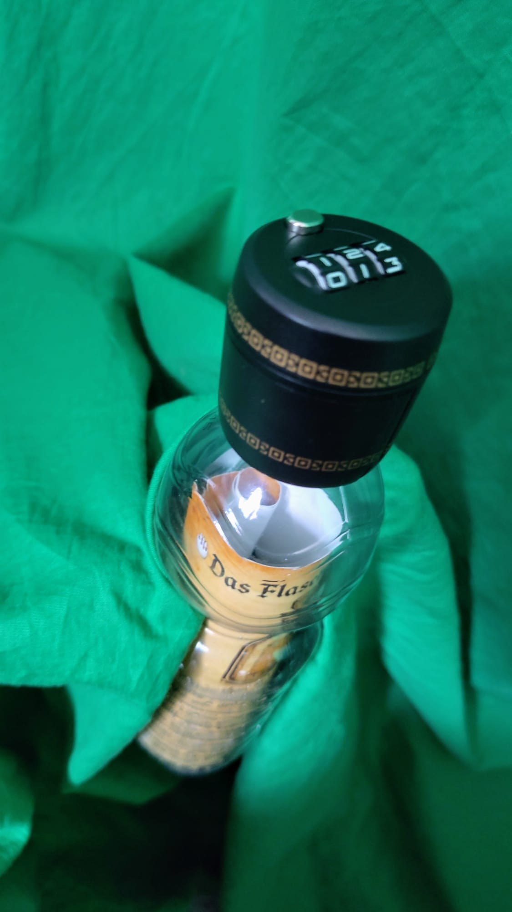
  <figcaption><a href="https://creativecommons.org/publicdomain/zero/1.0/deed.de">CC0</a></figcaption>
</figure>

- [ ] Bluetooth Lautsprecher
- [ ] Foto-Ausdrucke  
    Bilder lassen sich leicht mit KI prompten mit *"Erstelle eine schatzkarte im Piratenstil im Hochkantformat, die vergilbt und gezeichnet ist. Darauf ..."*
- [ ] Dicke Karotte
- [ ] Kletterseil
- [ ] Kinder-Klettergurt
- [ ] Optional: Zahlenschloss für den Schatz

## Stationen

### Auftakt  
Findet die Flaschenpost!  
<figure>
  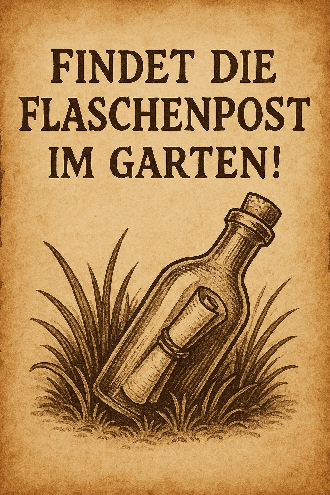
  <figcaption>Bild: <a href="https://creativecommons.org/publicdomain/zero/1.0/deed.de">CC0</a></figcaption>
</figure>

### 📍 Station 1: Das Flaschenrätsel  
> 🎂⚓ Das Flaschenrätsel  
>
> Den Kuchen habt ihr schon genossen  
> doch diese Flasche bleibt verschlossen,  
> Nur wer den Zahlencode errät,  
> dem offenbart sich, was drin steht.  
> Die Lösung liegt im Zahlenspiel –  
> kein Gold, doch Köpfchen braucht man viel:  
> Nimm das Alter, das heut zählt,  
> und was dies Haus als Nummer wählt.  
> Nimm beides MAL, sei klug und schlau,  
> dann weißt du’s sofort ganz genau.  
> Nur wer das Rätsel richtig spricht,  
> entkorkt den Schatz im Sonnenlicht.  
>
> ☠️ Wie lautet der Code, Matrose? ☠️  

<figure>
  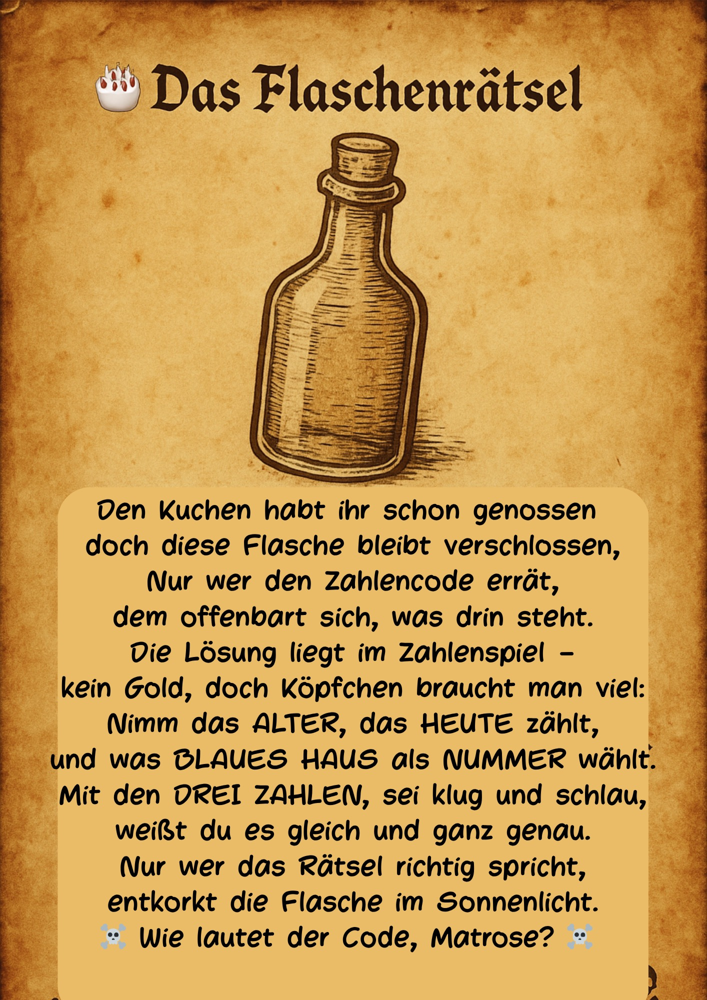
  <figcaption>Bild: <a href="https://creativecommons.org/publicdomain/zero/1.0/deed.de">CC0</a></figcaption>
</figure>

**Lösung** (kann abgewandelt werden): 7 + 23 => 723

### 📍 Station 2: Die Flaschenpost  
In der Flasche findet sich der nächste Hinweis.  
Dort steht:  
„Folge dem Ruf der Dohle!“  
<figure>
  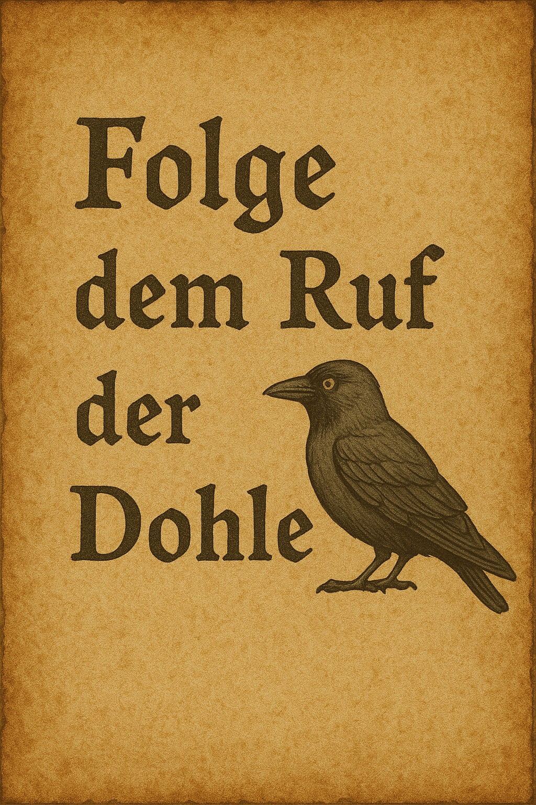
  <figcaption>Bild: <a href="https://creativecommons.org/publicdomain/zero/1.0/deed.de">CC0</a></figcaption>
</figure>

👉 Aufgabe: Ein versteckter Bluetooth-Lautsprecher spielt das wiederholende Vogel-Geräusch ***"RRRRRüüübe ab!" (mp3)***  
Die Kinder folgen dem Sound.

### 📍 Station 3: Die Dohle  
Am Sound-Ziel (z. B. hinterm Busch oder Sofa) finden sie neben dem Bluetooth-Lautsprecher (und evtl. einem Kuscheltiervogel) die Fotos mit den nächsten Hinweisen:

<figure>
  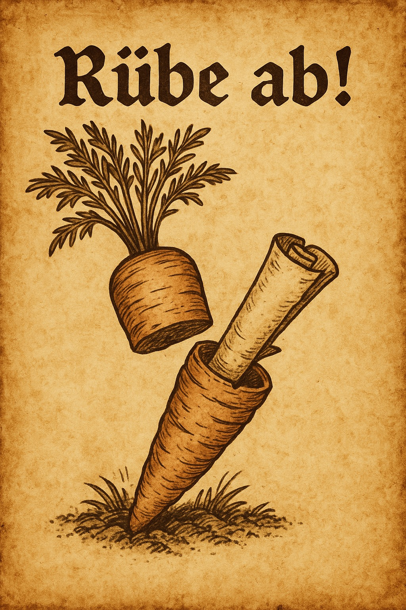
  <figcaption><a href="https://creativecommons.org/publicdomain/zero/1.0/deed.de">CC0</a></figcaption>
</figure>

<figure>
  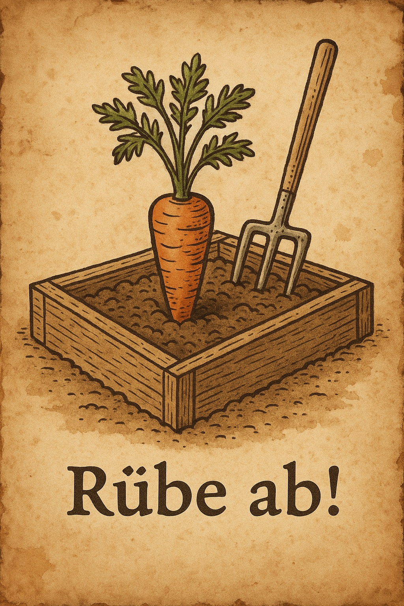
  <figcaption><a href="https://creativecommons.org/publicdomain/zero/1.0/deed.de">CC0</a></figcaption>
</figure>

<figure>
  <audio controls>
    <source src="audio/ruebeab.mp3" type="audio/mpeg">
    Dein Browser unterstützt das Audioelement nicht.
  </audio>
  <figcaption>
    Ton: <a href="https://creativecommons.org/publicdomain/zero/1.0/deed.de">CC0</a> 
    Titel: „Rübe ab!“ – Ruf der Dohle für die Schatzsuche
  </figcaption>
</figure>

### 📍 Station 4: Die Rübe  
Nun gilt es die Karotte zu suchen (z. B. in einem Gartenbeet versteckt)  
Die Piratenmannschaft darf "Rübe ab" die Möhre zerstören und findet darin den nächsten Hinweis  

<figure>
  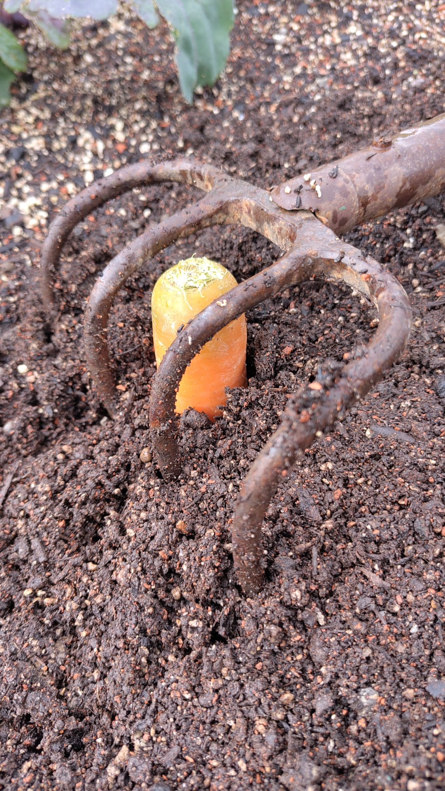
  <figcaption>Bild: <a href="https://creativecommons.org/publicdomain/zero/1.0/deed.de">CC0</a></figcaption>
</figure>

### 📍 Station 5: Olle Holzbein  
Olle Holzbein hat kein Holzbein mehr. Es wurde von Tante M geklaut. Bringt ihm sein Holzbein zurück, damit er euch verrät wie es weiter geht.

<figure>
  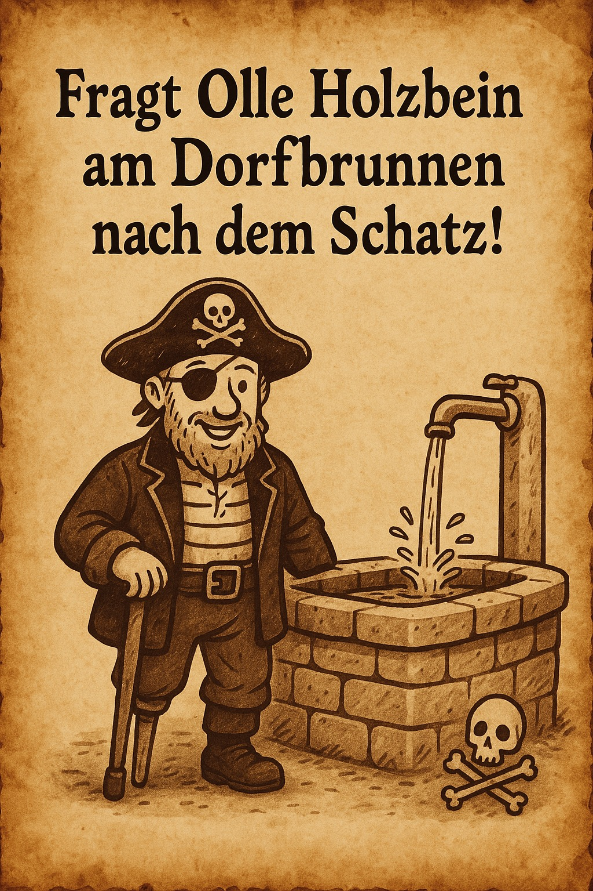
  <figcaption>Bild: <a href="https://creativecommons.org/publicdomain/zero/1.0/deed.de">CC0</a></figcaption>
</figure>

### 📍 Station 6: Tante M  
Im Laden steht das Holzbein von Olle (Einfach ein Holzpfosten in einem Stiefel) – Die Kinder bringen es Olle und er verrät den nächsten Hinweis

<figure>
  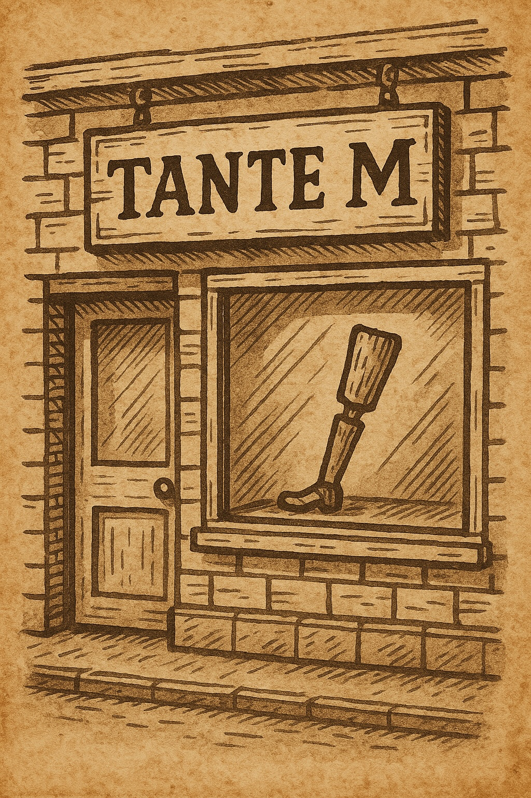
  <figcaption><a href="https://creativecommons.org/publicdomain/zero/1.0/deed.de">CC0</a></figcaption>
</figure>

### 📍 Station 7: Wieder bei Olle Holzbein  
Die Piraten bringen Olle sein Holzbein und bekommen den nächsten Hinweis und ein Kletterseil mit Gurt

<figure>
  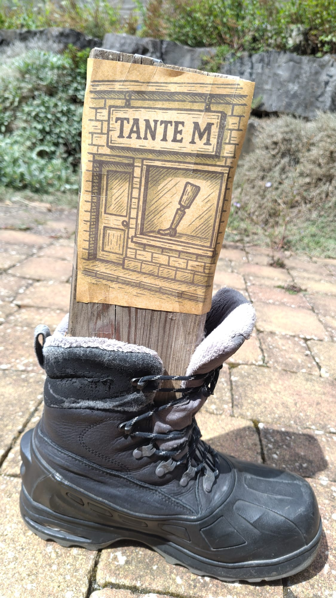
  <figcaption><a href="https://creativecommons.org/publicdomain/zero/1.0/deed.de">CC0</a></figcaption>
</figure>

> "Finde, Finde – ganz geschwinde,  
> bei der großen alten Linde,  
> Vor der Kirche im Winde der Linde  
> liegt das Rätsel, das ich verkünde  
> Suche an des Baumes Rinde  
> Los Matrose, Finde finde!"

<figure>
  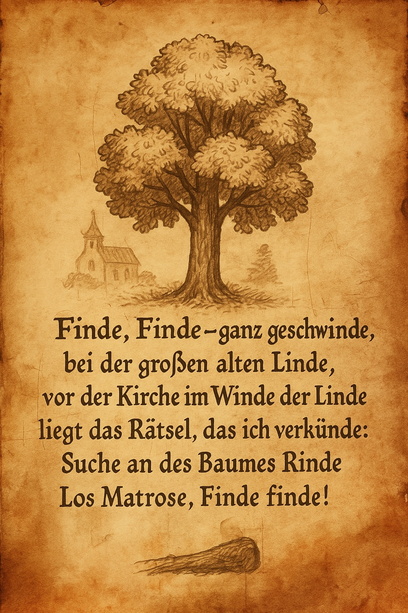
  <figcaption><a href="https://creativecommons.org/publicdomain/zero/1.0/deed.de">CC0</a></figcaption>
</figure>

### 📍 Station 8: Die Linde  
An der Linde finden die Kinder den nächsten Hinweis
<figure>
  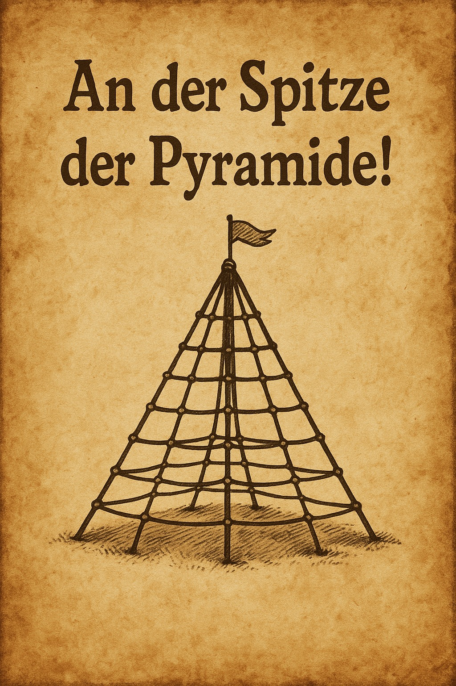
  <figcaption>Bild: <a href="https://creativecommons.org/publicdomain/zero/1.0/deed.de">CC0</a></figcaption>
</figure>

### 📍 Station 9: Die Pyramide  
An der Spitze des Klettergerüsts findet sich der nächste Hinweis mit einer Kastanie oder Kastanienblatt:
<figure>
  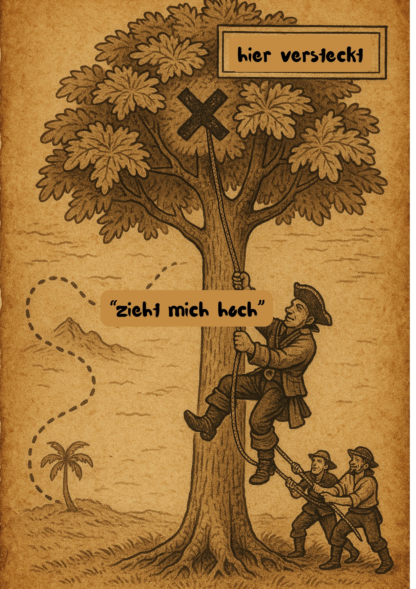
  <figcaption><a href="https://creativecommons.org/publicdomain/zero/1.0/deed.de">CC0</a></figcaption>
</figure>

### 📍 Station 10: Der Kastanienbaum  
<figure>
  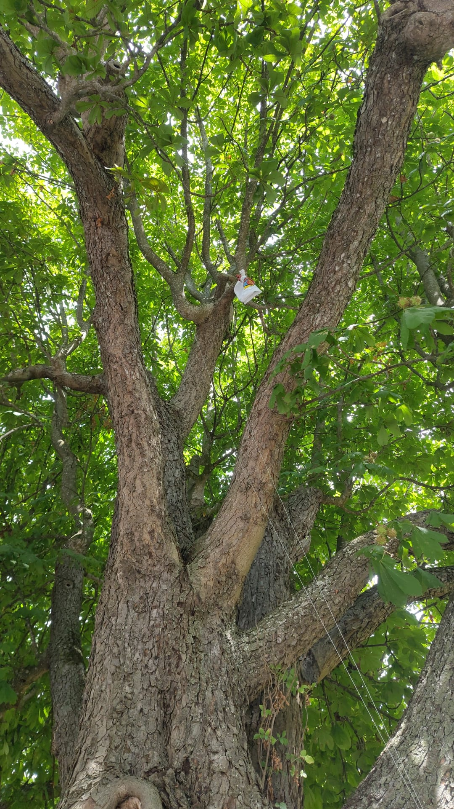
  <figcaption>Bild: <a href="https://creativecommons.org/publicdomain/zero/1.0/deed.de">CC0</a></figcaption>
</figure>

Am Baum wurde schon eine Schnur als Vorbereitung zur Top-Rope-Sicherung bereitgestellt. Die Piratenmannschaft fädelt ihr Seil ein und zieht gemeinsam 1 Kind am Klettergurt in die Baumkrone, um den nächsten Hinweis zu ergattern.

<figure>
  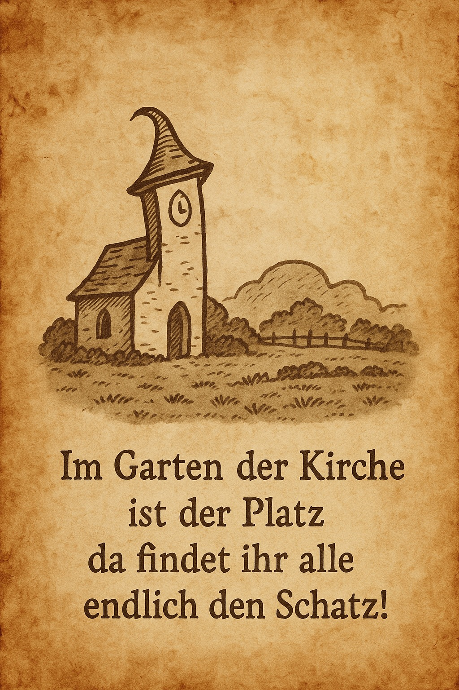
  <figcaption>Bild: <a href="https://creativecommons.org/publicdomain/zero/1.0/deed.de">CC0</a></figcaption>
</figure>

### 📍 Station 11: Der Kirchgarten  
Hier finden die Piraten endlich ihren Schatz. Die Truhe ist mit einem Zahlenschloss verriegelt. Die Zahlen dazu stehen auf der Rückseite der Hinweiskarten

## Bonusmaterial

### Piraten-Kloschild
<figure>
  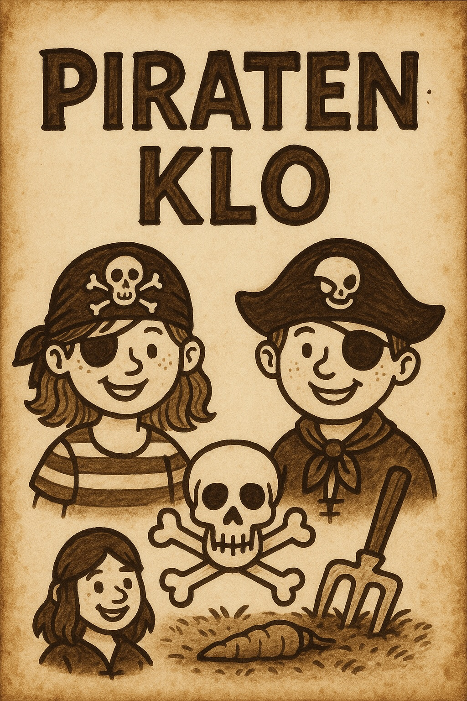
  <figcaption>
    Bild: <a href="https://creativecommons.org/publicdomain/zero/1.0/deed.de">CC0</a> 
    Prompt: „Erstelle mir ein Schild für die Toilettentür, das sowohl Seeräubermädchen als auch Seeräuberjungs einen eindeutigen Hinweis gibt, dass man hier auf Klo kann.“
  </figcaption>
</figure>
Witzig, dass durch den ChatGPT-Kontext jetzt wieder die Rübe mit reinkommt ;-)

## 📦 Offene Materialien zum Download & zur Weiterarbeit

Diese interaktive Schnitzeljagd steht dir **komplett zur freien Nutzung und Bearbeitung** bereit.  
Alle Inhalte – inklusive **Markdown-Dateien**, **Grafiken** und **Audio** – findest du im öffentlichen GitHub-Repository.

<a href="https://github.com/joerglohrer/Piraten-Schnitzeljagd-7-9" style="display: inline-block; padding: 0.75em 1.5em; margin-top: 1em; background-color: #0366d6; color: #fff; font-weight: bold; text-decoration: none; border-radius: 5px;" role="button" aria-label="Zum Repository auf GitHub öffnen">
🔗 Zum GitHub-Repository
</a>

💡 Du kannst dort auch eigene Ideen beitragen, Materialien anpassen oder neue Aufgaben erstellen!

<figure>
  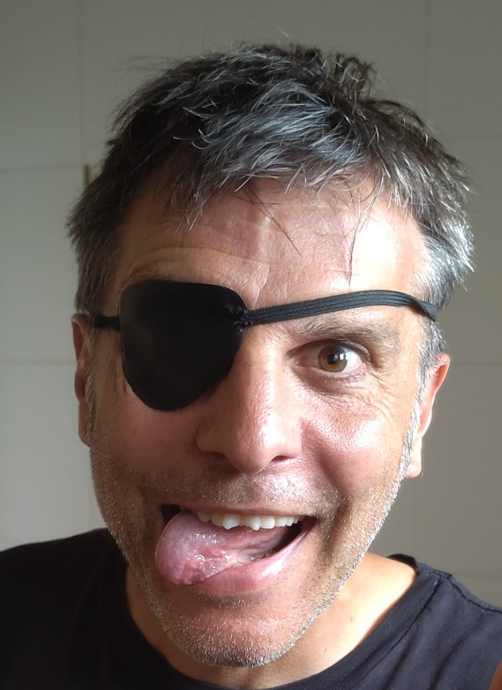
  <figcaption><a href="https://creativecommons.org/publicdomain/zero/1.0/deed.de">CC0</a></figcaption>
</figure>

Die Schatzsuche wurde inspiriert von [Kirsten Boie und ihrem Buch Seeräuber-Moses](https://www.kirsten-boie.de/buch/seeraeuber-moses/). Dankeschön!